## Informe de Laboratorio

### INTEGRANTES
- Jeyder Nicolay Leon Lancheros
- Juan Camilo Cristancho Velasquez

---

### 1. Familiarización con el código base

Dentro de todo nuestro programa, tenemos dos clases esenciales que son dos clases
modelo que son `Blueprint` y `point`, la primera, hace referencia a un plano, el cual 
tiene un nombre y autor y una lista de puntos, la segunda clase es un record que
guarda una coordenada (x,y) que hace parte del plano.

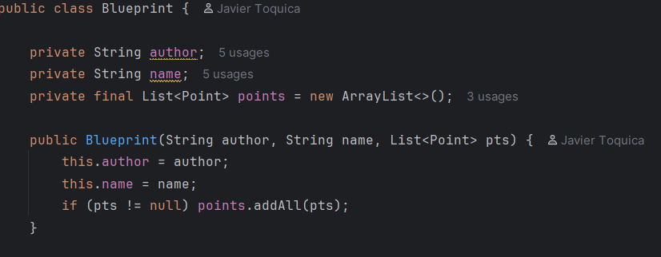


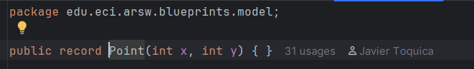

La capa de persistencia de este programa está totalmente en memoria y la estructura
principal cuenta con 4 elementos, el primero de estos es la interfaz
`BlueprintPersistence` que es la que tiene los métodos principales de buscar planos
y puntos en su base de datos, es la que es llamada por el service y es una interfaz
para que su implementación no afecte el funcionamiento de los servicios
(inyección de dependencias), luego está la clase que implementa la interfaz llamada
`InMemoryBlueprintPersistence`, esta maneja un HashMap interior donde guarda todos los
planos y sus puntos, por lo que cuando alguien llama al método de buscar un plano,
lo busca en este hash con el titulo como clave. Las ultimas dos clases de persistencia
son dos tipos de excepciones, las cuales se lanzan cuando se busca un plano que no
existe o cuando se quiere crear un plano que ya existe.

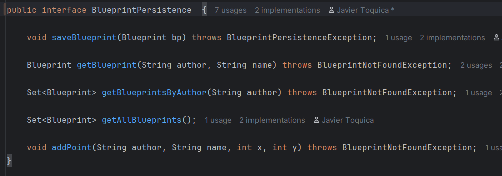

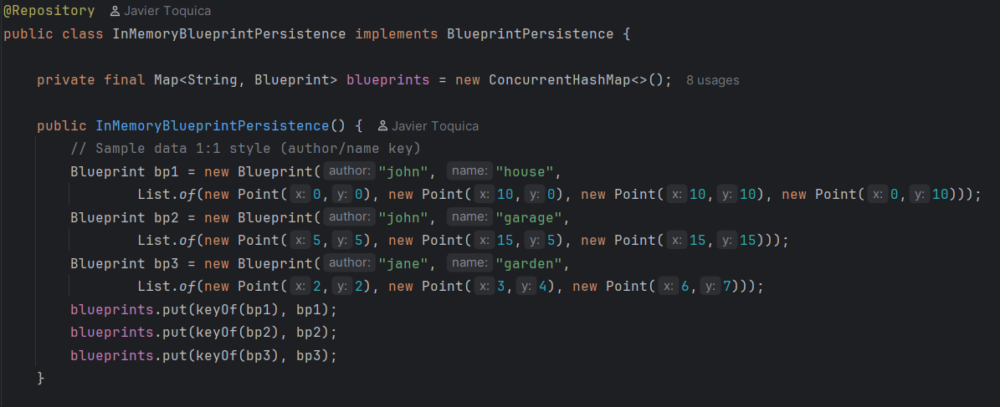

La clase de servicios `BlueprintsServices`, nos ofrece 6 funcionalidades las cuales
nos permiten buscar o crear un plano, ver todos los planos, o uno con un titulo
en específico, y añadir a un plano un punto. Esta presente la interfaz de persistencia
anteriormente mencionada. Luego en el controller están todos nuestros endpoints que
corresponde uno por cada funcionalidad, se hace buen uso de la inyección
de dependencias, ya que solo llama en su constructor a una clase de servicios.

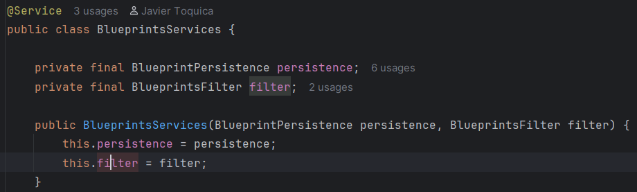

---
### 2. Migración a persistencia en PostgreSQL

Para migrar la base de datos a `PostgreSQL`, tomamos la decisión de usar un
`Docker-compose`, este es un orquestador de contenedores que nos ayuda a levantar
la base de datos y al mismo tiempo la aplicación, para saber como levantar y probar
el programa puedes leer la siguiente guía.

Empezamos añadiendo las dependencias necesarias de `PostgreSQL` y `JPA` para añadir
posteriormente las entidades y la nueva clase de repositorio, configuramos el
`Docker-compose` en dos partes, uno para correr Maven y el otro para levantar la
base de datos, en el segundo contenedor definimos el usuario y contraseña por defecto.

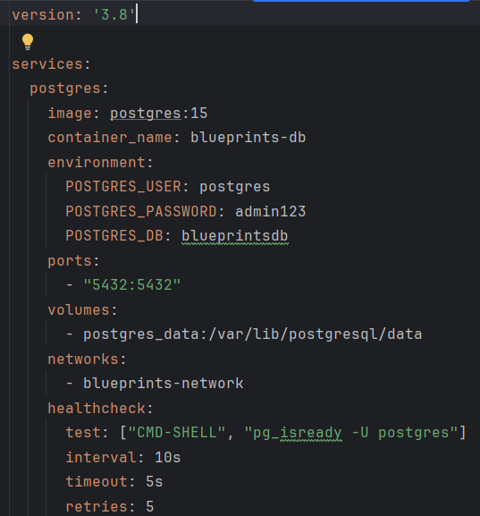

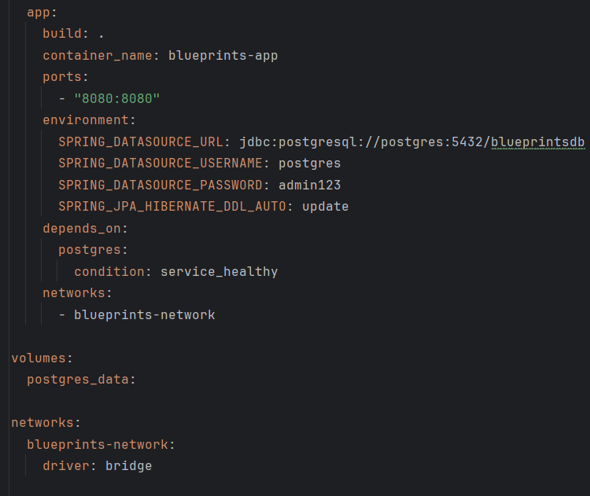

Para que `SpringBoot` se conecte con la base de datos, añadimos la configuración
a las `application.propierties`, así si Spring quiere ingresar a la DB puede ver
la información del usuario ahí mismo. Tambien cabe mencionar que solo creamos
el contenedor de PostgreSQL para el programa principal, para pruebas usamos una
base de datos en `H2` para que intervengan las pruebas y no consuma recursos
de la DB principal, para esto creamos un archivo `application-test.propierties`
y la configuramos.

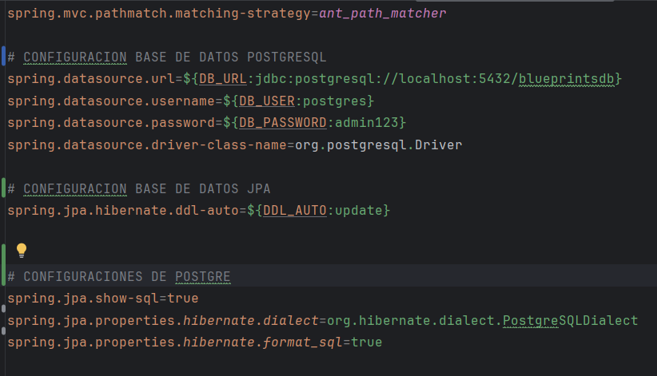}

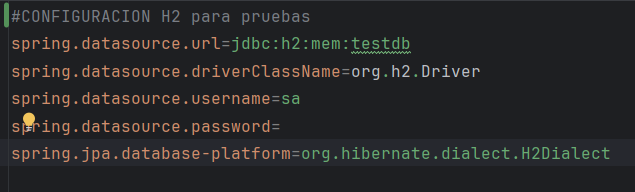

Continuamos creando las entidades de los planos y puntos al igual que en modelo,
ya como estas hacen parte de la base de datos se establece la relación uno a muchos
entre el plano y los puntos.

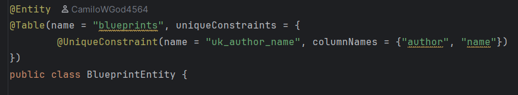
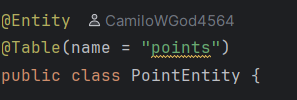

Creamos el repositorio que implementa la interfaz de `BlueprintRepository`,
manteniendo así el contrato con la interfaz principal, ya esta se encarga
de guardar la entidad en su base de datos y manteniendo las mismas excepciones
que en el modelo original.

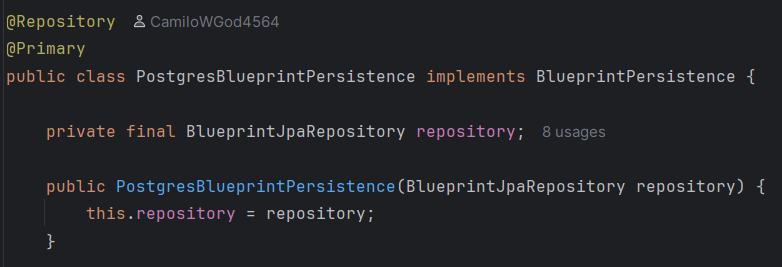

---
### 3. Buenas prácticas de API REST

Cambiamos el path base en el controlador

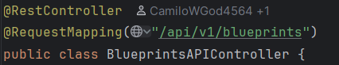

Creamos una clase de ApiResponse para todas las respuestas de los endpoints,
esta contiene los distintos `códigos HTTP` que pueden ocurrir mientras se ejecuta
y se prueba.

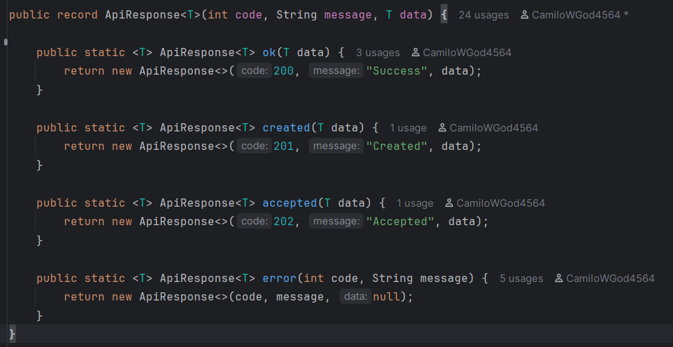

Ya por ultimo, cambiamos la salida de cada endpoint por la de un `ApiResponse` para
cumplir con el formato, y lo podemos ver cuando probamos `Swagger`.

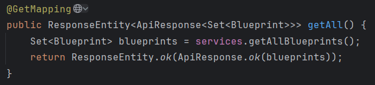

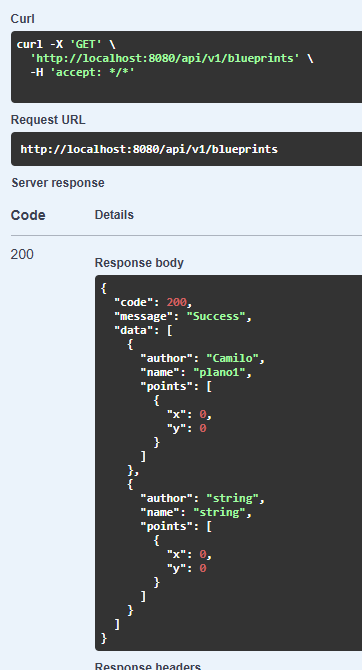

---
### 4. OpenAPI / Swagger

Para la buena documentación de swagger, usamos las siguientes anotaciones.

`@operation`
Nos ayuda a dar dos descripciones a cada endpoint, uno en la pestaña principal
resumendo que el lo que hace, y ya dentro del endpoint otra descripción más larga
complementando la idea de como funciona.

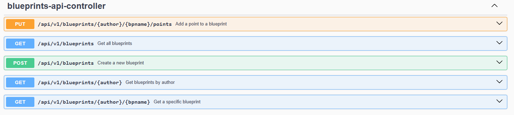

`@ApiResponse`
Este nos da un tipo lista con todos los posibles códigos HTTP que puedan intervenir
al momento de ejecutar una funcionalidad, nos muestra el happy path con su modelo de 
respuesta y los demás códigos por si no falla.

Dentro del programa hubo un problema al llamar a librería de SpringBoot de `ApiResponse`
ya que se confundia con la clase generia que tiene el mismo nombre, por ende en algunos
endpoints se ve más completa al momento de importarla.

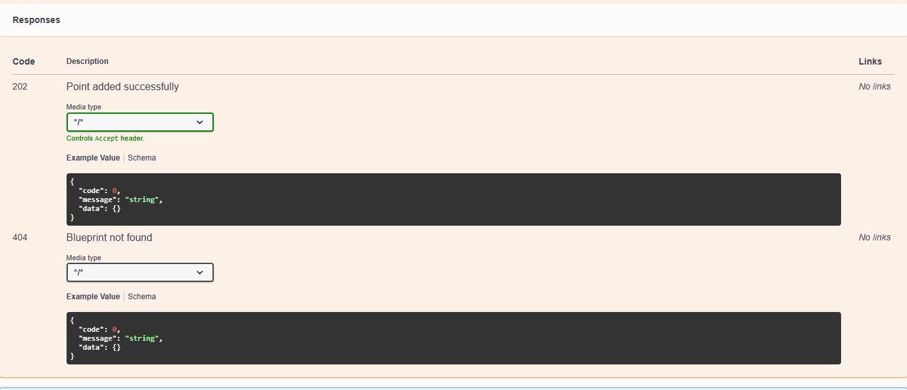

---

### 5. Filtros y pruebas

Se implementaron los filtros `RedundancyFilter` y `UndersamplingFilter`. El primero elimina puntos duplicados consecutivos y el segundo conserva los puntos con índices pares. Los perfiles `redundancy` y `undersampling` son excluyentes; cuando ninguno está activo, se usa `IdentityFilter`.

La selección se puede verificar ejecutando:

```bash
mvn spring-boot:run -Dspring-boot.run.profiles=redundancy
mvn spring-boot:run -Dspring-boot.run.profiles=undersampling
```

También se añadieron pruebas unitarias para ambos filtros y pruebas de integración con H2 para creación, consulta y respuestas `400` y `404` de la API. Se ejecutan con:

```bash
mvn test
```

Para evidenciar los mensajes almacenados en PostgreSQL con Docker, después de crear un blueprint desde Swagger se puede ejecutar:

```bash
docker compose exec postgres psql -U postgres -d blueprintsdb -c "SELECT b.author, b.name, p.x, p.y FROM blueprints b JOIN points p ON p.blueprint_id = b.id ORDER BY b.id, p.point_order;"
```

Las buenas prácticas aplicadas incluyen versionamiento de la API, DTO de respuesta uniforme, validación de solicitudes, manejo centralizado de errores, códigos HTTP semánticos, documentación OpenAPI y persistencia desacoplada por medio de la interfaz `BlueprintPersistence`.
